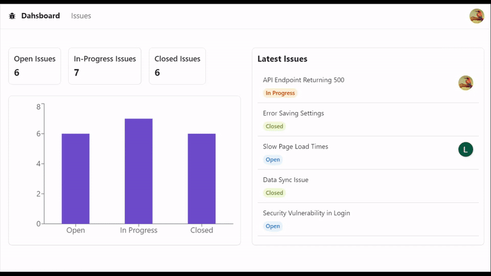

 

  
  <h3 align="center">Issue Tracker</h3>

  

    <a href="https://lorena-swe-issue-tracker.vercel.app" target="_blank">View Website</a>
    ·
    <a href="https://github.com/lorena-swe/issue-tracker">Code</a>
  

  

## About The Project

  

Issue Tracker is a web application designed to help teams manage and track issues efficiently. The app features a comprehensive dashboard for viewing the latest issues, a bar chart categorizing issues by their status (Open, In Progress, Closed), and an issue list page where all issues can be viewed and managed.

**Features**

- **Dashboard**: View the latest issues and a bar chart showing the distribution of issues by status.
- **Issue List**: Filter issues by status and sort by title, status, or created date. View issues in a table format for easy management.
- **Authentication**: Secure login through Google authentication using NextAuth.
- **Issue Management**: Create, edit, and delete issues. Each issue includes a title and a description, with the description supporting React Markdown for rich text formatting.
- **User Experience**: Loading skeletons provide a smooth user experience while data is being fetched.

## Built With

- [Next.js](https://nextjs.org/)
- [NextAuth.js](https://next-auth.js.org/)
- [Prisma](https://www.prisma.io/)
- [MySQL](https://www.mysql.com/)
- [Radix UI](https://www.radix-ui.com/)
- [TailwindCSS](https://tailwindcss.com/)
- TypeScript
- HTML & CSS
- Axios

## Getting Started

To get started, follow these steps:

1. Clone this repository to your local machine.
2. In the project folder, rename **.env.example** to **.env**.
3. Set **all** the environment variables according to the instructions in the file. Ensure they are set properly for the application to work.
4. Run `npm install` to install the dependencies.
5. Run `npx prisma migrate dev` to generate your database tables.
6. Run `npm run dev` to start the web server.

## Usage

After setting up, you can start managing issues by creating new ones, editing existing issues, and tracking their progress on the dashboard.

## Contributing

Contributions are what make the open source community such an amazing place to learn, inspire, and create. Any contributions you make are **greatly appreciated**.

1. Fork the Project
2. Create your Feature Branch (`git checkout -b feature/AmazingFeature`)
3. Commit your Changes (`git commit -m 'Add some AmazingFeature'`)
4. Push to the Branch (`git push origin feature/AmazingFeature`)
5. Open a Pull Request

## License

Distributed under the MIT License. See `LICENSE` for more information.

## Contact

Lorena - [LinkedIn](https://www.linkedin.com/in/lorena-zotaj/)

Project Link: [https://github.com/lorena-swe/issue-tracker](https://github.com/lorena-swe/issue-tracker)

(<a href="#top">back to top</a>)

